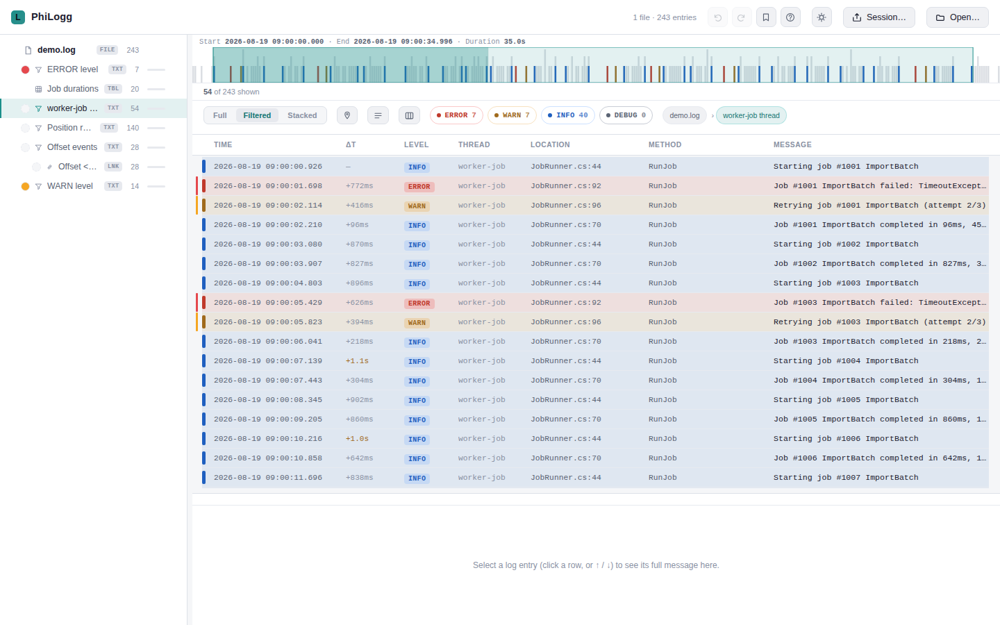
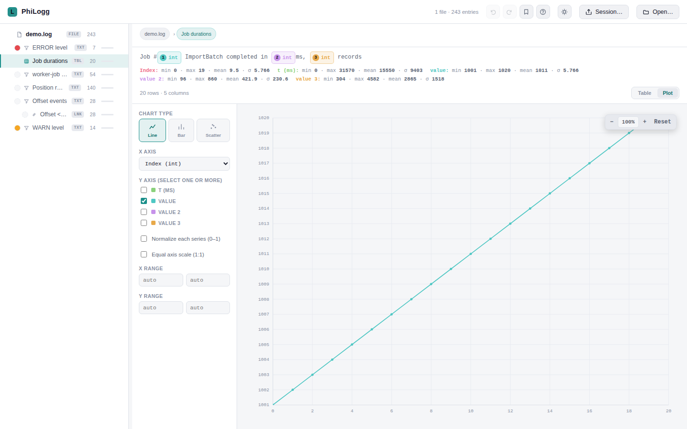
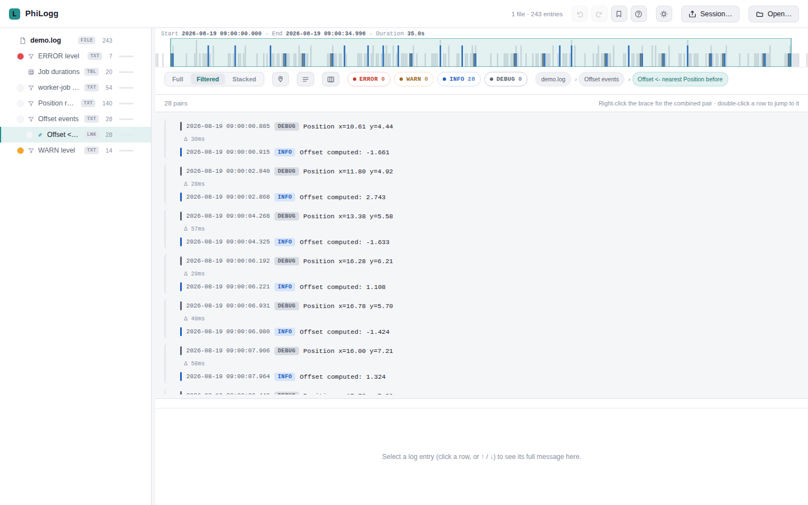
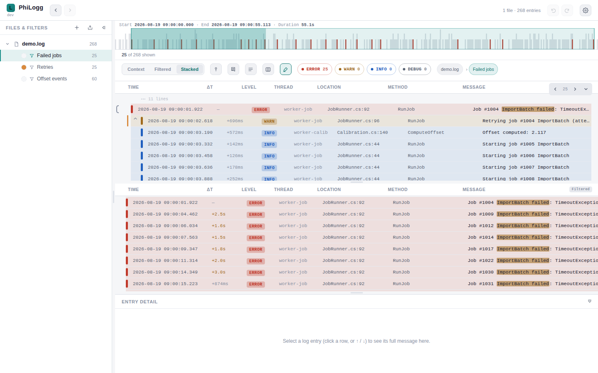
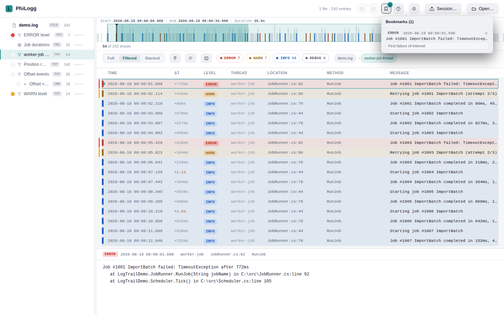
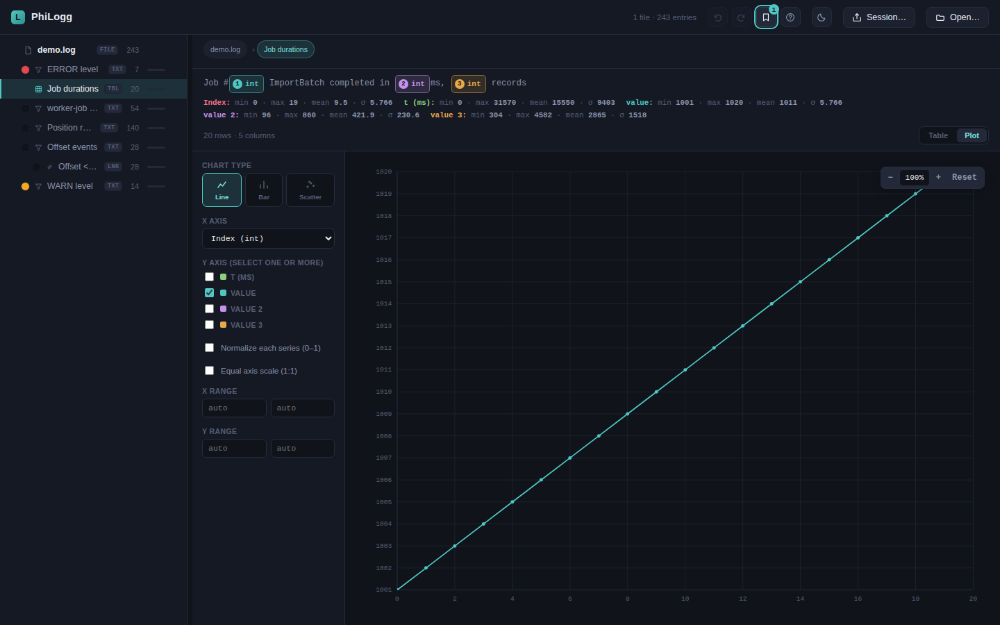

# PhiLogg

A log viewer for line-oriented log files with a **freely configurable line
format** (log4net-style by default), a nested filter tree, value extraction
into a spreadsheet-like table, plotting, and nearest-neighbor event
correlation across log lines.

The application itself is one self-contained `philogg.html` file — no build
step, no external dependencies (not even a CDN font), no server-side
component required. That single-file nature is about the app, not about how
many log files it can open at once (it loads and merges several, see
"Multi-file drag-and-drop" below) — and it's what makes several different
deployments possible:

- **Open the file directly** — download `philogg.html` and double-click it
  (or `File → Open` from any browser). No install, no server, fully offline,
  works straight from `file://`. Best for a quick, ad-hoc look at a log on
  your own machine.
- **Serve it yourself** — put `philogg.html` on any static web server or
  internal tool (including a CI pipeline's artifact/report host) and open it
  over `http(s)`. This is what enables **deep-link loading**
  (`philogg.html?url=<encoded-url>`), so a CI job or report page can link
  straight into a pre-loaded log for a teammate — not possible from a local
  `file://` open.
- **Desktop app** — the optional Electron wrapper in `desktop/` packages
  `philogg.html` unmodified into a native-feeling app with `.log` file
  associations and a frameless window, so double-clicking a log file opens
  it straight into PhiLogg like any other document. See `desktop/README.md`.

## Screenshots

| | |
|---|---|
|  Log view with filter tree |  Extraction table |
|  Plotting extracted values |  Link (nearest-neighbor pairing) view |
|  Full/Filtered split with highlight colors |  Bookmarks & detail panel |
|  Dark theme (default) | |

A guided feature tour with more screenshots lives in [`homepage/index.html`](homepage/index.html) —
open it in a browser to view it.

## Key features

- **Nested filter tree** — chain text, time-range, value-extraction, AND/OR,
  nearest-neighbor link, time-context and count-context filters; each level
  narrows/transforms the result of the one above it. Any node can be
  **renamed** (`F2` or right-click → "Rename…") with a human-readable label
  shown in the tree/breadcrumb instead of the raw pattern — handy for turning
  a chain into a readable narrative ("Step 3: calibration errors"). Editing a
  filter's actual value moved to `Ctrl+E`.
- **Level bar can write into the filter tree** — by default, clicking
  ERROR/WARN/INFO/DEBUG on the level bar creates/edits a real, undoable
  filter-tree node at your current position, instead of a separate global
  toggle. Its label is colored in the log level's own color, each level
  name its own solid color when several are combined on one node (e.g.
  "ERROR, INFO" shown as a red word and a blue word, no blending). Settings
  → Behavior can switch this to "Manual" to keep the original
  tree-independent quick-filter, with an "Add to tree" button to push the
  current selection in on demand.
- **Text-filter match highlighting** — see exactly which substring an active
  text filter matched, marked inline in the Filter view's rows and/or the
  entry-detail panel. Toggle it on/off from the view bar (next to the
  multi-line/pin-bookmarks buttons); Settings → Behavior controls whether it
  shows only the filter you're currently drilled into or every text filter
  in the chain, and where the marks appear.
- **Highlight rules underline their own matches** — a colored text filter
  doesn't just tint the row's left edge: the matched substring itself is
  underlined in that rule's color, in both views and the entry detail. Each
  line runs at a constant depth, so it stays straight where rules overlap —
  overlapping stretches alternate between the colors involved instead of one
  overwriting the other. Its own view-bar toggle, on by default.
- **Filter navigation without losing your place** — switching the active
  filter, whether with `Alt+Arrow` or a plain mouse click in "Files &
  Filters", never takes keyboard focus off the log view you're reading, so
  arrow keys keep navigating log rows right afterward; `Alt+Arrow` also
  peeks a collapsed panel open (`Ctrl+0` does the same peek). `Alt+Enter`
  opens "Filter for this message" for the selected row directly. Switching
  filters while the selected row doesn't match the new one shows it at its
  would-be position as a temporary anchor instead of losing it — Settings →
  Behavior controls how it's drawn (shown briefly then removed by default,
  always shown, or never drawn but still remembered for Up/Down) and whether
  it's shown at all when the new filter belongs to a different file.
- **Value extraction** — turn a pattern like `x=[value:float] y=[value:float]`
  into a spreadsheet-style table with per-column stats, value assertions, and
  a Plot tab (line/bar/scatter/3D scatter, zoom/pan/rotate, click a point to
  jump to its log entry). `float`/`int` placeholders can also carry an inline condition —
  `[value:float>=10]`, `[value:int<20,>10]` for a range, or `[value:float|>=10]`
  to compare against the absolute value — so a pattern matches/extracts only
  the entries whose value actually satisfies it.
- **Link filter** — pair up nearest-preceding/following entries across two
  filters (e.g. "the last position reading before each error"), chainable
  into multi-hop tuples via a guided dialog.
- **Full/Filtered split** — one narrowed "Filtered" view plus a
  color-highlightable "Full" view of the whole file, side by side or
  stacked.
- **Live tailing & folder watch** (Chromium, File System Access API) — an
  actively-written log file updates in place, with both the Full and
  Filtered views auto-following the newest entry; a watched folder picks up
  new files automatically.
- **Multi-file drag-and-drop** — every dropped file shows up in the tree
  right away (grayed while it waits its turn to load), and loading several
  at once offers to merge them into one chronologically-sorted file.
- **Deep-link loading** — `philogg.html?url=<encoded-url>` fetches and opens
  a log at boot, for linking straight to a log from CI/a report (requires
  PhiLogg itself served over `http(s)`, not opened as a local file, and CORS
  on the remote log server).
- **"Open File Location" / "Copy URL"** — a file's tree context menu jumps
  straight to its containing folder in the OS file manager whenever a real
  path is known (desktop app: files opened via the picker, drag-drop, folder
  watch, or a `.log` file association); a plain `http(s)` deep-linked file
  offers "Copy URL" instead, since there's no local folder to reveal.
- **Bookmarks** (surfaced as an auto-managed filter node per file) **and free-text notes** on any log line, **undo/redo, timeline minimap with drag-to-select.**
- **Session cache** — reload the browser tab and get your files, filters,
  and settings back.
- **Filter save/load** (`.json`) and a **reusable filter library** for
  presets you apply across different files.
- **Session export/import** — package an analysis (files, filters,
  bookmarks, notes) to share with a colleague.
- **Configurable log formats** (Settings → Format Manager) — define
  additional formats (a log4net-style conversion pattern, or a raw regex
  for edge cases) and map them to files by filename pattern; the log4net-style
  default format still works with zero configuration. Each format also picks
  **which log levels it uses and in what order** — any subset of
  ERROR/WARN/INFO/DEBUG/TRACE plus your own custom names (NOTICE, FATAL,
  VERBOSE, …), each getting a color of its own — that's what the level
  quick-filter bar shows for files using it; anything else falls into OTHER.
- **Configurable themes** (Settings → Appearance) — Dark, Light, four
  Catppuccin flavors (Latte/Frappé/Macchiato/Mocha), or import your own as
  JSON (download a template, fill in your colors, import it back). Pick a
  system-installed UI font family (the desktop wrapper additionally offers
  every font actually installed on your machine, e.g. Fira Code or
  Iosevka), and independently scale the overall UI
  and the log/text content size. Resizable/toggleable columns, multiline
  message display, multi-row select + copy, and a horizontal scrollbar in
  the Filter view for reading long messages in full.
- **"On open, scroll log to"** (Settings → Behavior) — start at the top
  (default) or jump straight to the bottom, continuing to follow live
  updates from there if Tailing is on.
- **Collapsible sidebar & detail panel** — collapse the file tree to a
  40px rail or the detail panel to its header, via the chevron,
  `Ctrl+B`/`Ctrl+J`, or double-clicking the resizer. Hovering either while
  collapsed peeks it back open (sized to its content, up to half the
  window, looking exactly like the expanded panel), without losing your
  place — two independent Settings → Behavior toggles let you turn this
  off per panel if you'd rather only expand one or both by clicking.

See [`homepage/index.html`](homepage/index.html) for the full, illustrated
feature list, and `PROJECT.md` for how each of these actually works
internally.

## Getting started

1. Download `philogg.html` (or clone this repo).
2. Open it in a browser — double-click it, or `File → Open` from any
   browser. No server needed.
3. Load a log file via **Open…** or drag-and-drop.

Works in any modern browser for one-shot file loading. **Live tailing and
folder watch require the File System Access API**, currently
Chromium-based browsers only (Chrome, Edge, …) — Firefox and others still
open and analyze files, just as static snapshots.

## The log format it reads

Log line formats are not fixed — they're fully configurable via
**Settings → Format Manager**: define any number of formats as a
`%d %p %t %c %M %m %n`-style conversion pattern, or drop down to a raw regex
for shapes the pattern language can't express, then map filenames to a format
with a glob rule (e.g. `app-*.log`). Every configured format still produces
the same fixed entry schema (timestamp/level/thread/location/method/message),
so filters, sorting, and export work identically regardless of which format
parsed a given file.

Out of the box, with zero configuration, PhiLogg falls back to a log4net-style
conversion pattern:

```
%d\t%p\t"%t"\t%c\t[%M]\t"%m"%n
```

i.e. tab-separated `timestamp / level / "thread" / file:line / [method] /
"message"`. The parser is tolerant: any line that doesn't look like a new
entry is treated as a continuation of the previous entry's message, so
multi-line stack traces come through intact — for the default format and any
custom one alike.

See [`examples/bracket-format.log`](examples/bracket-format.log) for a sample
in a different shape to try the Format Manager against.

## Repository layout

```
philogg.html                          the application — everything lives here
tests/
  philogg.regression.test.js          jsdom regression suite (drives the real file via DOM events)
  README.md                           testing conventions
tools/
  log-simulator.html                  standalone tool: writes a growing .log file (any configured pattern), for testing tailing/folder watch
desktop/
  README.md                           Electron wrapper: build/run steps, current status
  main.js, package.json, electron-builder.yml   file associations + CLI file opening (loads philogg.html unmodified)
homepage/
  index.html                          static feature-tour / marketing page
  screenshots/                        screenshots used by the homepage and this README
examples/
  general.log                         a sample log file in the default format
  bracket-format.log                  a sample log file in a different format, for trying the Format Manager
scripts/
  install_pkgs.sh                     helper for installing test dependencies
.github/workflows/release.yml         manual workflow: stamps a version and publishes a tester build
.github/workflows/desktop-release.yml manual workflow: builds the desktop/ Electron wrapper per OS (untested, see desktop/README.md)
PROJECT.md                            architecture entry point + index into docs/ (start here to work on the code)
docs/                                 per-topic current-state architecture reference (filters, UI, extraction, persistence, desktop, testing)
CHANGELOG.md                          full chronological, dated changelog
FEATURE_BACKLOG.md                    unelaborated feature ideas
CLAUDE.md                             instructions for AI coding sessions on this repo
```

## Development

Regression tests use jsdom to load the real `philogg.html` and drive it
through actual DOM events (clicks, drag, keyboard, form submits):

```bash
cd tests
npm install
npm test
```

See `tests/README.md` for the suite's conventions before extending it.
`tools/log-simulator.html` is a separate, standalone tool for exercising
live tailing / folder watch against a real, growing file.

Project documentation is split by audience:

- **This README** — what PhiLogg is and how to use it, for people.
- **`PROJECT.md`** — architecture entry point: core data model, known
  gotchas, and an index into `docs/*.md` for per-feature detail. Read this
  first before changing code, human or AI session alike.
- **`docs/*.md`** — current-state architecture reference, one file per
  topic cluster (filters, UI/views, extraction/plotting,
  persistence/sync, desktop, testing/limitations).
- **`CHANGELOG.md`** — the full chronological, dated history of what
  shipped and why.
- **`FEATURE_BACKLOG.md`** — raw, unelaborated ideas for future work.
- **`CLAUDE.md`** — short, load-every-session instructions for AI coding
  sessions.

## Versioning & releases

`philogg.html` carries a `PHILOGG_VERSION` constant, which stays the literal
string `"dev"` in source control. The manual **"Build tester release"**
GitHub Action (`.github/workflows/release.yml`) stamps a checked-out commit's
short SHA into a copy of the file and publishes it as a GitHub Release asset
— the tracked file in this repo is never modified by it.

## License

PhiLogg is **proprietary software**, © Philipp Klein. All rights reserved.
It is currently shared only for a limited testing phase; redistribution and
modification are not permitted. See the in-app **Settings → License**
section for the full terms, or contact philogg@kleinphilipp.de.
