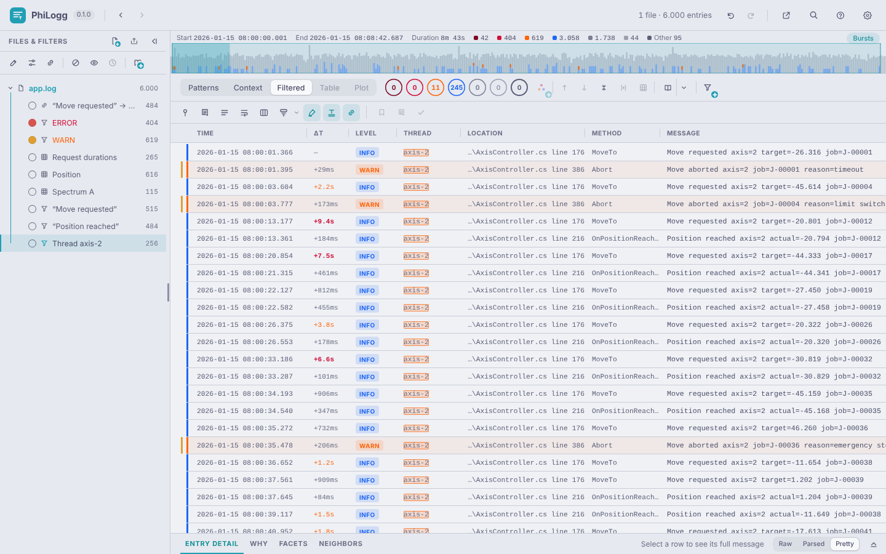
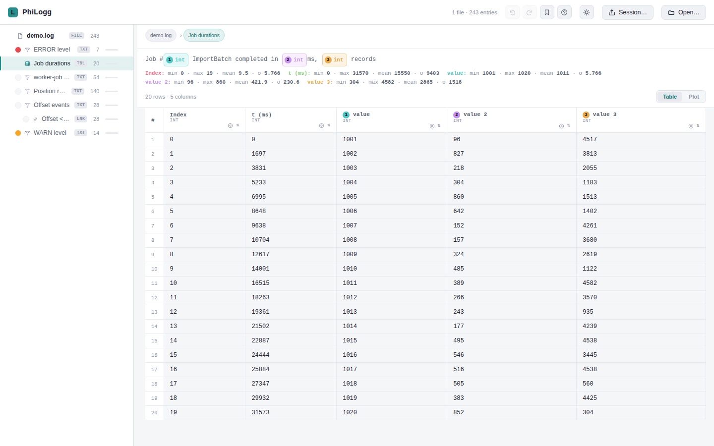
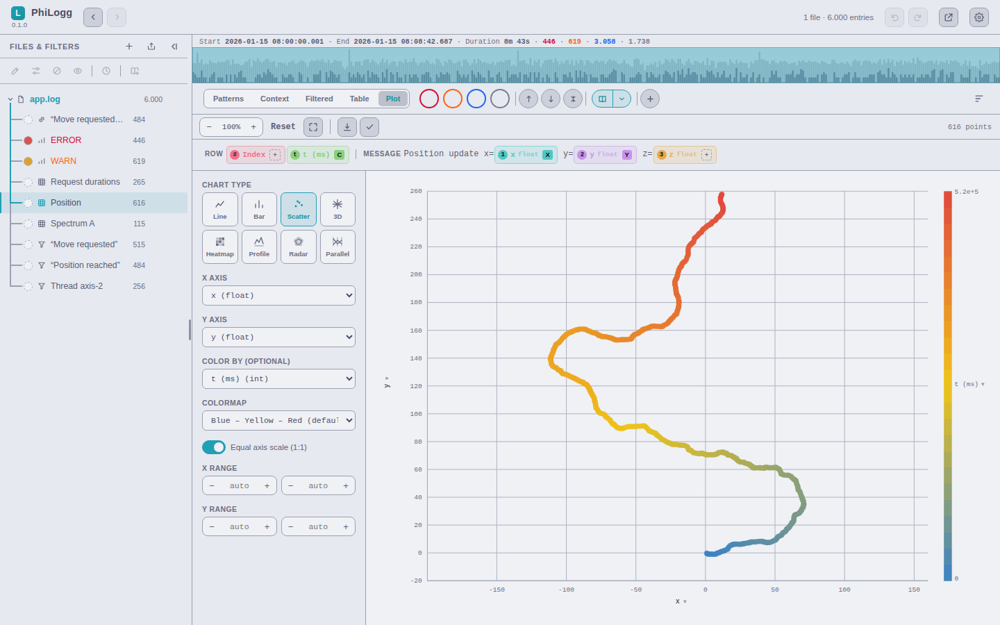
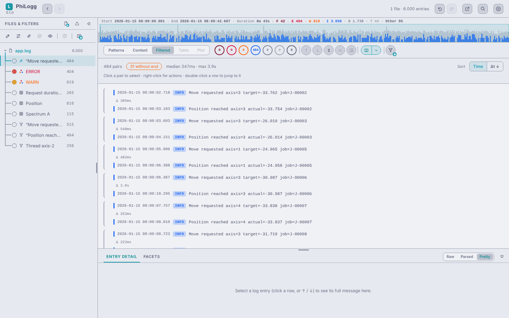
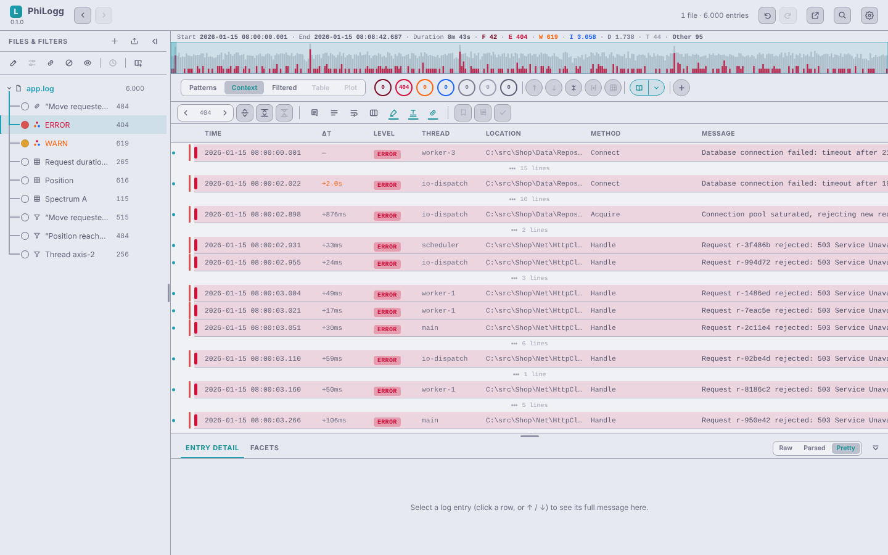
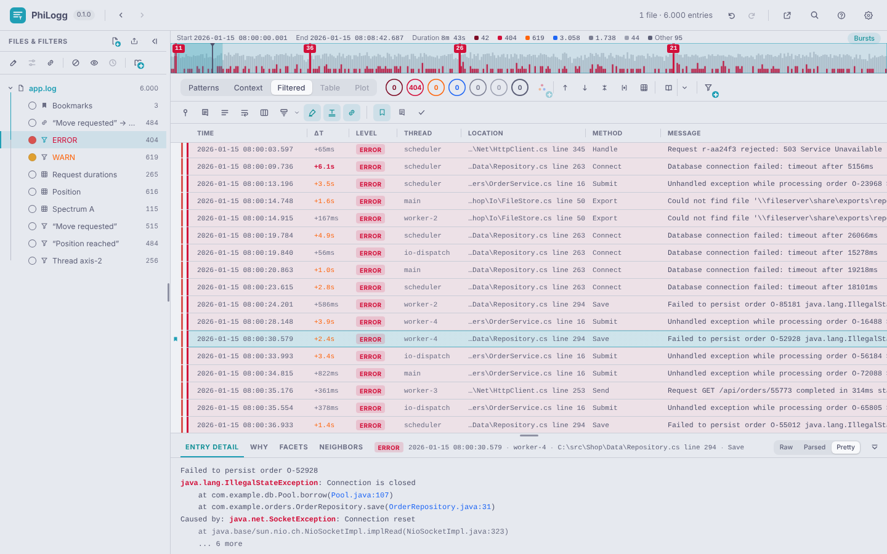
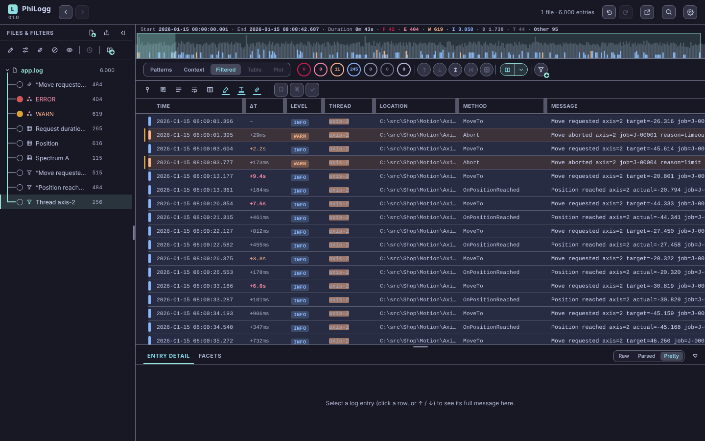
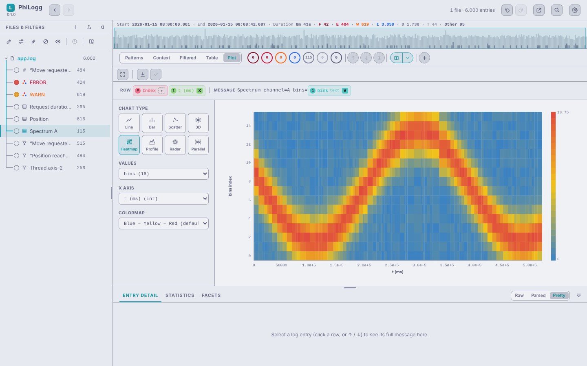
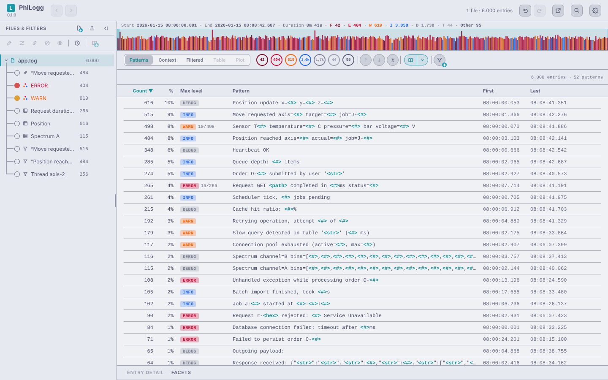
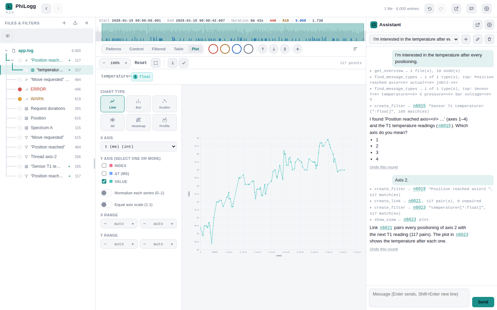

# PhiLogg

<!-- toc: generated by scripts/doc-toc.js, do not edit by hand -->
- [Screenshots](#screenshots)
- [Key features](#key-features)
- [Getting started](#getting-started)
- [The log format it reads](#the-log-format-it-reads)
- [Homepage](#homepage)
- [Repository layout](#repository-layout)
- [Development](#development)
- [Versioning & releases](#versioning--releases)
- [License](#license)
<!-- /toc -->

A log viewer for line-oriented log files with a **freely configurable line
format** (log4net-style by default), a nested filter tree, value extraction
into a spreadsheet-like table, plotting, and nearest-neighbor event
correlation across log lines.

The application itself is one self-contained `philogg.html` file — no build
step, no external dependencies (not even a CDN font), no server-side
component required. That single-file nature is about the app, not about how
many log files it can open at once (it loads and merges several, see
"Multi-file drag-and-drop" below) — and it's what makes several different
deployments possible:

- **Open the file directly** — download `philogg.html` and double-click it
  (or `File → Open` from any browser). No install, no server, fully offline,
  works straight from `file://`. Best for a quick, ad-hoc look at a log on
  your own machine.
- **Serve it yourself** — put `philogg.html` on any static web server or
  internal tool (including a CI pipeline's artifact/report host) and open it
  over `http(s)`. This is what enables **deep-link loading**
  (`philogg.html?url=<encoded-url>`), so a CI job or report page can link
  straight into a pre-loaded log for a teammate — not possible from a local
  `file://` open.
- **Desktop app** — the optional wrapper in `desktop/` packages
  `philogg.html` unmodified into a native-feeling app with `.log` file
  associations and a frameless window, so double-clicking a log file opens
  it straight into PhiLogg like any other document. Built on Tauri and the
  OS's own webview, so the installer stays small. Desktop-only extras
  include close-to-system-tray and picture-in-picture: a diagonal `<->`
  window-control button shrinks the window to a small always-on-top content
  view (with its own return-to-full and minimize buttons). Log files opened
  from disk are read and parsed natively (Rust, on all CPU cores) with the
  same parsing rules as the browser build. See `desktop/README.md`.

## Screenshots

| | |
|---|---|
|  Log view with filter tree and column-restricted text match |  Extraction table with statistics |
|  Plotting extracted values — XY scatter colored by time, equal axis scale |  Link (nearest-neighbor pairing) view, matched by job id |
|  Context view — matches plus expandable gaps |  Bookmarks & detail panel with a stack trace |
|  Dark theme (Catppuccin Mocha) |  Heatmap of an array column over time |
|  Patterns tab — messages grouped by shape |  Assistant (desktop app): a local LLM builds a link and a plot, chat docked |

## Key features

- **Nested filter tree** — chain text, time-range, value-extraction, AND/OR,
  and nearest-neighbor link filters (time-context and count-context filters
  also exist and fully work, but creating a new one is temporarily
  unreachable — see `docs/filters.md`); each level narrows/transforms the
  result of the one above it. Connector lines tie each filter to its
  parent, and the path down to the selected filter is highlighted, so the
  active chain reads straight off the tree. The Files & Filters sidebar has its own icon
  toolbar (same icon+hover-label style as the log view's own toolbars) with a
  fixed set of buttons — Rename, Edit filter, Invert (NOT), Mute, Adjust clock and
  Add to library — that enable or disable with the current selection.
  **Mute** (eye button on the row, toolbar, right-click, or `M`) switches a filter
  off without deleting it: it passes its parent's entries through unchanged, its
  children keep working, and it stays in the tree struck through. Selecting 2+
  nodes swaps that row for the bulk actions on a highlighted bar: AND / OR /
  Link… over any number of filters of one file, or Merge N files (or a short
  hint when the selection can't be combined). Without a keyboard, long-press a node → **Select multiple** puts the tree in a select mode with a checkbox per row and a **Done** button. It sits alongside the
  tree's existing right-click menu (Copy/Cut/Save filter… stay there). Any node can be **renamed** (`F2` or right-click → "Rename…") with
  a human-readable label
  shown in the tree instead of the raw pattern — handy for turning
  a chain into a readable narrative ("Step 3: calibration errors"). Editing a
  filter's actual value moved to `Ctrl+E`. A text filter can be
  case-sensitive, restricted to specific columns, inverted (NOT),
  interpreted as a real regular expression, or limited to **whole-word
  matches** ("Test" matches "Test is active", not "Testing activated").
  While you type, the filter dialog previews the result live: the match
  count, a histogram of the matches over time, and the first matching rows
  with the hit marked.
- **Level bar: a quick view filter, with "Add to tree"** — clicking
  FATAL/ERROR/WARN/INFO/DEBUG (and TRACE or "Other" whenever the file has
  such entries) on the level bar narrows the Filtered view without touching
  the filter tree; the selection stays on while you switch nodes. Every
  entry is accounted for: the chip counts always add up to the entries of
  the active node. "Add to tree" turns the current selection into a real,
  undoable level node (labelled in the level's own color, each name its own
  solid color when combined). On a phone the chips read "E 134", on a tablet
  they get their own row when the toolbar is too narrow.
- **Timing analysis for multi-threaded logs** — a **Gap filter** keeps
  entries that follow a pause of at least X ms/s/min, optionally measured
  per thread, source file, or any column (a stall in one thread no longer
  hides behind the others' chatter); the Filtered view shows each row's
  measured gap, and sorting the Δt column (largest first) ranks where the
  most time is lost — no threshold needed. The **Link filter** can pair only entries that belong
  together ("Same" chips suggest the fields both events share, e.g. `job`, with
  the ID-like one preselected, or a column such as Thread) and show only pairs
  with Δt above/below a limit, with a live "192 pairs · 13 without end" preview;
  the Link view sorts pairs by Δt and shows the starts that never got an end.
  An extraction on link pairs gets a Δt column to plot durations over time. See `docs/filters.md`.
- **Text-filter match highlighting** — see exactly which substring an active
  text filter matched, marked inline in the Filter view's rows and/or the
  entry-detail panel. Toggle it on/off from the view bar (next to the
  multi-line/pin-bookmarks buttons); Settings → Behavior controls whether it
  shows only the filter you're currently drilled into or every text filter
  in the chain, and where the marks appear.
- **Find in the current view without creating a filter** — `Ctrl+F` opens a
  small find bar (also the magnifier button in the header) over the log view: it searches only the rows the current
  view (Context or Filtered) shows, marks every hit as you type, jumps to
  the first one, and counts them ("3 / 41"). `F3`/`Shift+F3` (or `Ctrl+G`/`Ctrl+Shift+G`,
  `Enter`/`Shift+Enter`) walk the hits with wrap-around; match-case and
  regex toggles use the same query language as a text filter. When a search
  turns out to be worth keeping, **Add as filter** (`Ctrl+Enter`) turns it
  into a real filter node — `Ctrl+Shift+F` opens the filter popup directly.
  With two or more files open, every file in the tree also shows how many
  entries of the whole file match; click a count to jump to that file's
  first hit. Stays fast on views with hundreds of thousands of rows.
- **Recent-filter suggestions** — the filter popup and the find bar offer a
  dropdown of recently used filters and searches (with their Regex/Match
  case/Whole word/NOT settings): pick with the arrow keys or the mouse, remove
  entries you don't want to see again.
- **Patterns: a log's message shapes at a glance** — the **Patterns** tab
  (first in the view selector, `Ctrl+1`) groups the current filter result by message *shape*: numbers, GUIDs, IP
  addresses, paths, hex values and quoted strings become placeholders, so
  `Axis 2 position 1532.44 reached in 12 ms` and `Axis 1 position 88.10
  reached in 9 ms` are one row, `Axis <#> position <#> reached in <#> ms`,
  with its count, share, most severe level (a mixed group shows how many entries have it, e.g. `WARN 3/179`) and first/last time. Sort by
  count ascending to surface rare messages. Click a pattern to filter for
  it, Alt+click (or ⊘) to hide it as a NOT filter and keep narrowing the
  noise, **Extract** to open it straight in Table/Plot with the numbers as
  typed columns, or jump to its first entry. Stays responsive on 100 MB
  logs (one pass, computed in the background, cached per filter result).
- **Facet panel: who/what produces these entries?** — a tab of the bottom
  panel next to Entry detail (`Ctrl+I`; the log keeps its full width) shows the value distribution of every column (Thread, Location, Method,
  custom columns, Level, and Source for a merged file) over the current
  filter result: the top values with count, share and a bar, each value coloured by the most
  severe level it occurs with, "+k more" to
  see the rest. Click a value to add a filter for exactly that value;
  Alt+click or right-click adds it as NOT to hide a dominant source of
  noise. On a tablet, long-press a value for a menu (show only / exclude / copy); long file paths start at their file name. Both features only ever add ordinary, undoable nodes to the filter
  tree.
- **Highlight rules underline their own matches** — a colored text filter
  doesn't just tint the row's left edge: the matched substring itself is
  underlined in that rule's color, in both views and the entry detail. Each
  line runs at a constant depth, so it stays straight where rules overlap —
  overlapping stretches alternate between the colors involved instead of one
  overwriting the other. Its own view-bar toggle, on by default.
- **Filter navigation without losing your place** — switching the active
  filter, whether with `Alt+Arrow` or a plain mouse click in "Files &
  Filters", never takes keyboard focus off the log view you're reading, so
  arrow keys keep navigating log rows right afterward; `Alt+Arrow` also
  peeks a collapsed panel open (`Ctrl+0` does the same peek). The arrows
  also stop on not-yet-loaded (grayed) ZIP entries and watched-folder files
  (the file you were reading is deselected and the main area says the entry
  is not loaded) — `Right` loads one, `Shift` skips them. `Alt+Enter`
  opens "Filter for this message" for the selected row directly. Switching
  filters while the selected row doesn't match the new one shows it at its
  would-be position as a temporary anchor instead of losing it — Settings →
  Behavior controls how it's drawn (shown briefly then removed by default,
  always shown, or never drawn but still remembered for Up/Down) and whether
  it's shown at all when the new filter belongs to a different file.
- **Back / forward through where you looked** — the two arrows next to the
  wordmark (and your mouse's back/forward buttons) retrace your steps the way
  Visual Studio or Rider do, which is a different thing from Undo: a step is
  a place you actually looked at, not an edit you made. Switching filters
  counts, so does jumping into the Context view or onto a bookmark, and so
  does scrolling somewhere and staying there for a moment — a fast flick to
  the end of a file leaves one step at the destination, not fifty on the way,
  and just walking rows with the arrow keys leaves none. Going back restores
  the whole view: the filter, the Context/Filtered/Stacked mode, the selected
  row, and the line you were reading.
- **Value extraction** — turn a pattern like `x=[*:float] y=[*:float]`
  into a spreadsheet-style table with per-column stats (the Statistics tab of
  the bottom panel, on Table and Plot), value assertions, and
  a Plot tab (line/bar/scatter/3D scatter, zoom/pan/rotate, click a point to
  show its log entry in Entry detail, double-click it to jump to its table
  row). Clicking a table cell shows that row's entry in Entry detail. Columns are named after the message
  (`temperature=[*:float] C` → axis "temperature [C]", also name/value tuples
  like `(xo, yo): (…)`), and in the Plot tab
  each pattern chip shows its role (X/Y/Z/Color) and assigns one on click. Several columns with different units compare as a
  **Radar** chart (one row against a few selected ones, each spoke on its
  own scale) or as **Parallel coordinates** (every row as one line across
  the axes; drag along an axis to keep a value range and select those rows
  in the table). A pattern restricted to a column tabulates that
  column; a column of **JSON arrays** can be shown joined, as one column per
  element, as aggregates (len/min/max/avg/sum) or as one row per element,
  and plotted as a **Heatmap** (element × time → color) or a **Profile**
  (one row's array, with other rows overlaid); both also work on a group of
  same-unit columns (e.g. `ch0=… ch1=… ch2=…`). `float`/`int` placeholders can also carry an inline condition —
  `[*:float>=10]`, `[*:int<20,>10]` for a range, or `[*:float|>=10]`
  to compare against the absolute value — so a pattern matches/extracts only
  the entries whose value actually satisfies it. Numbers with thousands separators
  (`1,234.5`, `1.234,5`) are read as one value; `[*:float@en]` /
  `[*:float@de]` pin the number format where it is ambiguous (`12,345`). When a pattern holds an int/float placeholder, the filter popup shows a
  "Narrow" row whose chips write these conditions into it with one tap.
- **Link filter** — pair up nearest-preceding/following entries (e.g. each
  "Move requested" with its "Position reached") to measure how long things take.
  Right-click a row → **Pair with…**, click the end row: the Δt between the two
  rows shows at once, and **Pair all like these…** opens the link dialog
  prefilled. Also reachable from the new-filter popup ("Link two events…") and
  the tree menu ("Link with…", "Edit link…"); chainable into multi-hop tuples.
- **Context/Filtered split** — the narrowed "Filtered" view plus a
  "Context" view showing the same result *with the log around it*: the
  matches, and everything the filter rejected hidden between them,
  GitHub-diff style. By default a click on a result opens ten lines above
  and below it (configurable), and a "Show more (+n)" row grows either end
  a step at a time — the two directions independently. What is open is
  drawn as a line down the gutter between two carets; click it anywhere to
  fold the block back. Jump match to match with Ctrl+↑/↓ or the toolbar's
  ‹ / › buttons without going back to the tree, with the opened lines
  travelling along and the clicked line staying put on screen. Switching
  to the Context tab opens the lines around the selected result too, and a
  toolbar button opens that many lines around every match at once. Side by
  side or stacked.
- **Live tailing & folder watch** (Chromium, File System Access API — or
  any platform in the desktop build, which lists folders natively) —
  an actively-written log file updates in place, with both the Context and
  Filtered views auto-following the newest entry; a watched folder picks up
  new files automatically. Right-click a filter → **Alert on new matches**: while
  the file is tailed, new matches show a bell toast and a `+N` badge on the
  filter until you look at it. Each folder's own cog-icon settings dialog
  configures filename patterns (e.g. `App*.log`, `Input*.log`, each with its
  own auto-open-newest-file / auto-close-keep-N-open / show-M-newest-files
  rules — for every file type the folder lists, so a folder of `.json` or
  `.txt` files works the same as one of logs), plus include-subfolders — subfolders then show up as collapsible
  folder rows in the tree (collapsed at first, expanded automatically to a
  file an auto-open rule opens). Closing a watched folder (or a ZIP) with its
  ✕ closes the files opened from it, and a file deleted on disk disappears
  from the app; a folder that couldn't be listed shows the error in its dot's
  tooltip and is retried automatically.
- **Folder-watch minimap** — click a watched folder's own title to see a
  time-range timeline of its files (one bar per file, no files opened yet)
  instead of the normal log view. Hovering shows a time crosshair; dragging
  shows a "from → to · duration" label, same as the normal log minimap.
  Multi-select individual bars or drag a time window, then pick one of
  three actions: **load individually**, **merge in full** (no time filter),
  or **merge only the dragged window** — which, for a large file, reads
  only that time slice off disk instead of the whole file (a real
  load-time win, as long as the file's own entries are in chronological
  order), with a matching time filter already applied to the result.
  Files start loading in the background as soon as you select them (and
  while the merge-on-load dialog is still open for a multi-file drop, or
  when the keyboard cursor rests on an unloaded file), so the action often
  finishes almost instantly.
- **Open a `.zip` file as a log source** — pick or drop a `.zip` and get a
  read-only listing of what's inside, subfolders as collapsible folder rows
  in the tree (only the archive's central directory is read, nothing is
  extracted in bulk). Double-click a log file to inflate just that one entry
  and load it like any other, staying nested in the zip's own listing while
  open. Anything else opens with the OS's default app for it (or a browser
  tab in the plain-browser build) — no watching/polling (a ZIP is immutable
  once opened), and no extra library: uses the browser's native
  `DecompressionStream` Web API, identically in the plain-browser build and
  the desktop build.
- **Open gzip-compressed logs** — a rotated `app.log.1.gz` opens like any
  other log, however it arrives: drag-drop, the file picker, a watched
  folder (where `*.log` patterns also pick up the `.gz` rotations), a ZIP
  entry, or the desktop build's "Open in PhiLogg". It's decompressed on the
  fly by the browser's own `DecompressionStream`, with no extra library. A
  compressed file is a fixed snapshot, never live-tailed.
- **Text, JSON and XML files as editable-looking, filterable files** —
  `.txt`/`.json`/`.xml` open as one file, however they're opened (a ZIP
  entry, a watched folder, or a direct open/drag-drop). The Context view is
  an editor-style pane with line numbers; JSON/XML get syntax colors and
  collapsible multi-line sections, JSON opens pretty-printed (so a minified
  one-line document is readable) with a Pretty/Raw toggle, and selecting and
  copying behaves like a normal text pane even for huge files (a 19 MB,
  390k-line file opens in about a second). Filtered shows the same lines with
  the line number in place of the timestamp, so text, regex and wildcard
  filters, the extraction Table and Plot, and the find bar (Ctrl+F) all work
  on it, and a filter's matching lines are marked in the editor.
- **View common image files right in the app** — `.jpg`/`.jpeg`/`.png`/
  `.tiff`/`.tif` open in an image viewer with pan/zoom/reset (drag-to-select
  a region to zoom, same as Plot View). Every opened one is closable the same
  way a log file is (✕ or middle-click its row).
- **Multi-file drag-and-drop** — every dropped file shows up in the tree
  right away (grayed while it waits its turn to load), and loading several
  at once offers to merge them into one chronologically-sorted file. Files
  load and parse concurrently, and even a single large file is split across
  every CPU core (Web Workers where available), so a 100 MB log is on screen
  in about two seconds.
- **A merged file shows its "Sources"** — an expandable row under any
  merged file (alongside Bookmarks/Notes, in that order) lists which
  physical file (or, for a multi-pattern file below, which grammar) each
  entry came from, each with its own color swatch and still fully
  clickable/filterable on its own, so the different origins stay both
  visually distinguishable and individually workable with. A "Show
  Sources" toggle (Settings → Behavior) turns this off if you'd rather not
  see it.
- **Multi-pattern log files** — a file that interleaves two or more
  independent grammars line-by-line (e.g. an app log mixed with syslog
  blocks) can be split and auto-merged via a new **Meta** format (Settings →
  Format Manager): pick which existing formats to classify lines against, in
  order, and the file loads as one chronological, Sources-labeled result.
- **Deep-link loading** — `philogg.html?url=<encoded-url>` fetches and opens
  a log at boot, for linking straight to a log from CI/a report (requires
  PhiLogg itself served over `http(s)`, not opened as a local file, and CORS
  on the remote log server). `?session=<url>` opens a whole session file
  the same way (logs referenced by URL or embedded, filters, notes, an
  optional hint banner), and `?open=format` opens the format dialog.
- **"Open File Location" / "Copy Path" / "Copy URL"** — a file's tree context
  menu jumps straight to its containing folder in the OS file manager, or
  puts the path on the clipboard, whenever a real path is known. That's the
  desktop app only — no web API lets a browser resolve a dropped file back
  to a filesystem path. The desktop build knows the path for files opened
  via the picker, drag-drop, folder watch or a `.log` file association,
  because it is the thing that opens them. A plain `http(s)` deep-linked
  file offers "Copy URL" instead, since there's no local folder to reveal.
- **Jump from a log entry into a running IDE** (Settings → IDE Integration,
  desktop app on Windows only) — a log entry's Location column carries a
  file path + line number; configure a shared "anchor folder" name your
  logged and local checkouts have in common (e.g. `Projects`), then
  right-click a row for "Open in Visual Studio" (after connecting to one of
  your currently running instances — the Settings dialog shows which
  solution each has open) or "Open in Rider" (via a `jetbrains://` deep
  link — no connection step, Rider resolves the right window itself).
- **Works in narrow windows and on tablets and phones** — the layout follows
  the window width: below 1024px the file/filter tree becomes a slide-in
  drawer, below 600px log entries become readable cards with an entry-detail
  sheet opened by tapping a card (drag its handle to resize or close it; the header's Analyze button opens the same sheet on Facets or Patterns, to drill into a value or hide a noisy message pattern with one tap; read-only: no editing; Settings is a full-screen page), and touch devices get larger hit targets and
  long-press for the context menu.
- **Bookmarks** (surfaced as an auto-managed filter node per file) **and free-text notes** on any log line, **undo/redo, timeline minimap with zoom and drag-to-select time windows.**
- **Per-file clock offset** — a file's tree context menu ("Adjust clock…")
  applies a manual clock correction to one file's timestamps, for when one
  device's log is skewed relative to another's before you compare or merge.
  Enter it as a signed delta (`+1500` ms, `-2s`, `±HH:MM:SS.mmm`) or by setting
  the desired absolute time of the file's first line, with a live before→after
  preview; it's undoable and survives a reload.
- **Session cache** — reload the browser tab and get your files, filters,
  opened text/image files and settings back. In the desktop app a file is
  re-read from disk on the next start instead of being copied into the
  cache, so a file deleted or moved in the meantime is left out of the
  restored session.
- **Filter save/load** (`.json`) and a **reusable filter library** for
  presets you apply across different files — the **Library ▾** button in the
  Filter-Toolbar opens a searchable menu (apply a preset to the selected or
  active node, star it to pin it as a one-click pill, save the current filter,
  or open "Manage library…" to rename, re-icon, export, import or delete —
  with Undo). Presets can be exported and shared like everything else (see
  below).
- **One import for everything** — sessions, filters, filter presets, log
  formats, themes and syntax schemes are all shared as JSON: every list has
  an **Export** button, and **Open → Import…** (or simply dropping the file
  onto the app) recognizes what it is and opens it in the same editor you'd
  use to create it, prefilled — nothing is added until you save. A filter
  file lands under the active node.
- **Session export/import** — package an analysis (files, filters,
  bookmarks, notes) to share with a colleague. Also reachable from Export /
  Share ("Session & filters": save the session or the active filter), and
  from the phone's Save button. Every save says what happened: "Saved",
  "Downloaded", "Not saved" or why it couldn't be saved.
- **Export / Share for tickets** (toolbar button or `Ctrl+Shift+E`) —
  "Copy for ticket" puts a compact excerpt on the clipboard, ready to paste
  into Jira, GitHub, GitLab, Azure DevOps or an e-mail: one short header
  (file, time span, the filter that produced the view), then the log lines
  you choose in one block — your notes right under their lines, and a
  `··· 45 lines · +2s ···` marker wherever quoted lines aren't neighbours in
  the file. Choose the lines: the rows you marked, all of the view, the first
  N, or your bookmarks. A named selection filter exports as a small "story"
  with its name as heading. Formats: Markdown, Jira wiki markup, plain text
  or **Rich text** (formatted HTML for Outlook, Confluence, Teams, Word) —
  remembered. Skip the dialog with **Copy for ticket** in a row's right-click
  menu, `Ctrl+Shift+C`, or a selection filter's context menu. The full
  current view saves as a ticket attachment via **Save file**:
  `.log` (raw lines), `.csv`, `.tsv`, or a standalone HTML report anyone can
  open without PhiLogg. Nothing leaves your machine unless you copy or save
  it.
- **Configurable log formats** (Settings → Format Manager) — define
  additional formats **by example**: paste or drop a few log lines and
  PhiLogg suggests a format right away, shown as a live table preview of how
  the lines will be split. Correct the suggestion by picking a column and
  selecting its value in the lines (with undo/redo), or edit the regex
  directly; the timestamp format and the log levels are detected from the
  examples too. Optionally map the format to files by filename pattern in
  the same dialog. The log4net-style default format still works with zero
  configuration. A file none of whose lines match its format shows a panel
  instead of an empty table, offering **Set up log format…** (the editor
  prefilled with the file's first lines; the file is re-parsed on save) or
  **Open as plain text**. **Custom columns**: each format picks its own set of
  columns, in your own order — Thread/Location/Method are each optional
  (drop any you don't need), and anything else can get a column of its own,
  right next to the built-in ones. Only Time and Level are always required.
  Each format also picks
  **which log levels it uses and in what order** — any subset of
  FATAL/ERROR/WARN/INFO/DEBUG/TRACE plus your own custom names (NOTICE,
  VERBOSE, …), each with an automatic color or one you pick yourself — that's
  what the level quick-filter bar shows for files using it; anything else
  falls into "Other" (its own chip, tooltip names the raw levels). Levels can also be matched by a numeric code instead of
  text (e.g. syslog severity), mapped to whichever names/colors you choose.
  **JSON Lines** (structured logging — Serilog, `JsonConsoleFormatter`,
  structlog, pino, …): paste a few lines and the keys are detected; pick
  which ones hold time, level and message, and which paths become columns —
  nested keys as `ctx.req.id`, array elements as `tags[0]`, keys containing
  a dot as `["http.status"]`.
  A **Meta** format mode combines several of your own formats into one:
  point it at an ordered list of target formats and a file matching it gets
  split by grammar and auto-merged (see "A merged file shows its 'Sources'"
  above) instead of being parsed as one grammar.
  **Share formats as JSON**: each format has an **Export** button (the file
  includes its filename patterns); importing it opens the format dialog
  prefilled, where you pick which filename patterns to take over.
- **Configurable themes** (Settings → Appearance) — Catppuccin Latte (light)
  and Mocha (dark) by default, **following your OS light/dark setting** and
  switching live when it changes (or pin Light/Dark instead; the light and
  the dark theme are each freely choosable). Available: the four Catppuccin
  flavors (Latte/Frappé/Macchiato/Mocha), Classic Light/Dark (the
  original pair), or your own: a **theme editor** with a color picker per color and a live preview (starts
  from the current colors; the lighter background tints follow their base
  color automatically). Edit, rename and export your themes.
  **Syntax-highlight colors** for embedded XML/JSON in the entry detail are
  separately configurable: follow the app theme (default), pick a built-in
  scheme, or make your own in the same editor — independent of which app
  theme is active. Pick a
  system-installed UI font family (the desktop wrapper additionally offers
  every font actually installed on your machine, e.g. Fira Code or
  Iosevka), and independently scale the overall UI
  and the log/text content size. Resizable/toggleable columns, multiline
  message display, multi-row select + copy, and a horizontal scrollbar in
  the Filter view for reading long messages in full.
- **Entry detail: Raw, Parsed or Pretty** — the detail panel below the log
  shows the selected entry in full: level, time, thread, the complete source
  location (path and line) and method in its header, the whole multi-line
  message below, in three stages. **Raw** shows the entry's original text
  exactly as it stands in the file — every line, tabs, quotes and
  indentation — with filter matches still marked (for a linked pair, both
  entries' original lines). **Parsed** shows the parsed message; **Pretty**
  (default) additionally pretty-prints and syntax-highlights XML/JSON
  embedded in it and highlights stack traces (Java, .NET, Python: exception
  types, your frames, dimmed framework frames, file:line). The choice is remembered across reloads.
- **Word wrap** — a soft-wrap toggle in each log toolbar wraps long messages
  instead of scrolling sideways (it also wraps the Entry Detail message), and
  on a text/JSON/XML file the same toggle wraps its lines instead. Both are
  distinct from multiline display, remembered across reloads, and off by
  default.
- **"On open, scroll log to"** (Settings → Behavior) — start at the top
  (default) or jump straight to the bottom, continuing to follow live
  updates from there if Tailing is on.
- **Collapsible sidebar & detail panel** — collapse the file tree to a
  40px rail or the detail panel to its header, via the chevron,
  `Ctrl+B`/`Ctrl+J`, or double-clicking the resizer. Hovering either while
  collapsed peeks it back open (sized to its content, up to half the
  window, looking exactly like the expanded panel), without losing your
  place — two independent Settings → Behavior toggles let you turn this
  off per panel if you'd rather only expand one or both by clicking.
- **Fullscreen focus mode** (desktop app) — `F11` (rebindable) drops into a
  distraction-free fullscreen: the header disappears, the sidebar and detail
  panel collapse to edge-hover overlays, and the active log/extraction view
  takes the whole window; the tabs, level bar and minimap stay.
  `F11` again or `Esc` leaves it. Real OS fullscreen is desktop-only, so the
  shortcut is bound only in the desktop app — a plain browser keeps its own
  `F11`.
- **Assistant: a local LLM operates PhiLogg** (desktop app, off by default —
  switch it on in Settings → Assistant) — a chat window (toolbar button) in which a model running on your
  own machine in [LM Studio](https://lmstudio.ai) (or any OpenAI-compatible
  server on `localhost`) finds message types, builds text/extraction/link
  filters, opens tables and plots, and bookmarks/annotates entries — asking
  back when your request is ambiguous. It never reads the raw log, only
  summaries, and talks to `localhost` only. Everything it creates appears
  in the filter tree right away (marked ✦); one message = one undo step,
  and every round has "Undo this round". The node and entry ids in its
  answers are links. The chat is its own window (optionally always on top)
  or docked as a side panel; several chats are kept. A bar above the input
  shows how full the model's context window is (hover for the token
  details). Needs a model with tool-calling support.

See `PROJECT.md` (and the `docs/*.md` files it links) for how each of these
actually works internally.

## Getting started

1. Download `philogg.html` (or clone this repo).
2. Open it in a browser — double-click it, or `File → Open` from any
   browser. No server needed.
3. Load a log file via **Open…** or drag-and-drop.

Works in any modern browser for one-shot file loading. **Live tailing and
folder watch require the File System Access API**, currently
Chromium-based browsers only (Chrome, Edge, …) — Firefox and others still
open and analyze files, just as static snapshots. In the browser, folders
the engine considers sensitive (Desktop, Downloads) can't be watched at all;
the desktop build has no such restriction, since it lists folders itself
rather than through that API.

## The log format it reads

Log line formats are not fixed — they're fully configurable via
**Settings → Format Manager**: define any number of formats from example
lines — PhiLogg suggests one automatically, you correct it by marking column
values in the examples or by editing the regex directly — then map filenames
to a format with a glob rule (e.g. `app-*.log`), right in the same dialog or
in the rule list. Time and Level are the only two mandatory columns —
Thread/Location/Method/Message are each individually optional per format,
and any other named regex group (`(?<name>...)`) becomes a **custom
column** of its own, in whatever order you arrange the format's columns.
**JSON Lines** files (one JSON object per line) get a format kind of their
own, with nested keys and array elements addressable by path. Filters, sorting,
and export all work the same regardless of which format parsed a given file
or which columns it defines.

Out of the box, with zero configuration, PhiLogg falls back to a log4net-style
conversion pattern:

```
%d\t%p\t"%t"\t%c\t[%M]\t"%m"%n
```

i.e. tab-separated `timestamp / level / "thread" / file:line / [method] /
"message"`. The parser is tolerant: any line that doesn't look like a new
entry is treated as a continuation of the previous entry's message, so
multi-line stack traces come through intact — for the default format and any
custom one alike.

See [`examples/bracket-format.log`](examples/bracket-format.log) for a sample
in a different shape to try the Format Manager against.

## Homepage

A product homepage (`site/`) is deployed to GitHub Pages together with a
hosted copy of the app and a guided tour that opens PhiLogg on its own manual
as a log; its download section reads the latest releases live. How it is
built and set up: [`docs/homepage.md`](docs/homepage.md).

## Repository layout

```
philogg.html                            the application — everything lives here
site/                                   the product homepage (static landing page); `scripts/build-site.js` builds it with the hosted app + tour, `.github/workflows/pages.yml` deploys it to GitHub Pages (see docs/homepage.md)
LICENSE.md                              license terms (PolyForm Noncommercial 1.0.0 + commercial evaluation), shipped with every build
tests/
  philogg.regression.test.js            jsdom regression suite (drives the real file via DOM events): harness + shared helpers
  groups/                               one file per test group
  fixtures/native-parse-golden.json     parsing golden file shared with the native parser's cargo test
  README.md                             testing conventions
tools/
  log-simulator.html                    log simulator UI: sample logs for every feature and format, as files or growing live (tailing/folder watch)
  log-sim/                              the simulator's engine (core.js), headless CLI (cli.js) and screenshot helper — see its README.md
  perf/                                 performance measurement scripts (test data, jsdom render profile, headless desktop-app load timing) — see docs/performance-testing.md
desktop/
  README.md                             desktop wrapper (Tauri): prerequisites, build/run steps, known limitations
  src-tauri/                            Rust backend + tauri.conf.json (file associations + native file/folder opening, loads philogg.html unmodified)
  src-tauri/logparse/                   native log parser (parallel, same rules as philogg.html's own), used by the desktop build
  THIRD_PARTY_NOTICES.md                licenses of every Rust crate in the desktop build (generated by cargo-about from about.toml/about.hbs)
examples/
  general.log                           a sample log file in the default format
  bracket-format.log                    a sample log file in a different format, for trying the Format Manager
scripts/
  install_pkgs.sh                       helper for installing test dependencies
  branch-status.sh                      session-start hint: how far the branch is behind main
  changelog.js                          prints changelog.d/ as one newest-first history (optionally since a date)
  doc-toc.js                            writes the table of contents of every doc over 100 lines
  strip-comments.js                     release-only: strips every comment out of a copy of philogg.html
  release-version.js                    release-only: computes the next beta version and stamps a version into the build's checkout
.github/workflows/release-please.yml      two-stage stable release: proposes the version bump on demand, then tags + publishes all variants (HTML/Windows/Windows portable/macOS/Linux) when that release PR merges
.github/workflows/beta-release.yml        manual beta pre-release from main (e.g. v0.2.0-beta.3), variants picked per run
.github/workflows/build-release-assets.yml  the build both release workflows share
.github/workflows/tests.yml               runs the regression suite on every session-branch push and PR
.github/workflows/rust-tests.yml          runs the Rust crate tests (`cargo test`: parser golden test, LLM loopback checks, path guard) when desktop/, the page or the golden fixtures change
.github/workflows/docs.yml                checks the docs' tables of contents on Markdown changes
release-please-config.json              release-please configuration (+ .release-please-manifest.json, the current version)
PROJECT.md                              architecture entry point + index into docs/ (start here to work on the code)
docs/                                   per-topic current-state architecture reference (filters, UI, extraction, persistence, desktop, testing, performance)
  screenshots/                          screenshots used by this README (generate.sh + scenes/ regenerate them)
  archive/                              finished concepts and implementation plans
changelog.d/                            dated changelog, one file per change
FEATURE_BACKLOG.md                      unelaborated feature ideas
test_scenario.md                        demo tasks for first-time users; the usability-test skill runs them in desktop/tablet/phone mode
CLAUDE.md                               instructions for AI coding sessions on this repo
```

## Development

Regression tests use jsdom to load the real `philogg.html` and drive it
through actual DOM events (clicks, drag, keyboard, form submits):

```bash
cd tests
npm install
npm test
```

See `tests/README.md` for the suite's conventions before extending it.
The **log simulator** generates realistic sample logs in every format
PhiLogg parses (default, custom columns, bracket, JSON Lines, syslog, mixed,
plain text), with content for each feature (link pairs, plots, array
columns, embedded XML/JSON, stack traces, bursts, gaps, …) — as files by
entry count or approximate size, or growing live for tailing and folder
watch. Use `tools/log-simulator.html` in the browser or the headless CLI:

```bash
node tools/log-sim/cli.js --list
node tools/log-sim/cli.js -f jsonl --size 20MB -o demo/
```

See [`tools/log-sim/README.md`](tools/log-sim/README.md). The screenshots in
this README (and any product page or guide) are produced with it too — see
`PROJECT.md` → "Sample data and screenshots".

Project documentation is split by audience:

- **This README** — what PhiLogg is and how to use it, for people.
- **`PROJECT.md`** — architecture entry point: core data model, known
  gotchas, and an index into `docs/*.md` for per-feature detail. Read this
  first before changing code, human or AI session alike.
- **`docs/*.md`** — current-state architecture reference, one file per
  topic cluster (filters, UI/views, extraction/plotting,
  persistence/sync, desktop, testing/limitations).
- **`changelog.d/`** — the dated history of what shipped and why, one
  file per change (`node scripts/changelog.js` prints it as one list).
- **`FEATURE_BACKLOG.md`** — raw, unelaborated ideas for future work.
- **`CLAUDE.md`** — short, load-every-session instructions for AI coding
  sessions.

## Versioning & releases

PhiLogg follows [semantic versioning](https://semver.org/) and stays under
`1.0.0` while it's in testing (starting at `0.1.x`, bugfix releases only,
until a deliberate decision to open up `0.2.0`). The toolbar shows the real
app version (e.g. `0.1.0`); Settings → License additionally shows the exact
build's short commit hash, useful when reporting a bug.

A real, versioned release is never triggered by an ordinary code change —
it's an explicit, two-step action: someone runs the **"Release Please"**
GitHub Action by hand to propose the next version (computed from commit
history via [release-please](https://github.com/googleapis/release-please)
— a new feature bumps the minor number, a bugfix bumps the patch number),
reviews the proposed release PR, and merges it when ready. That merge
automatically tags the release, publishes a GitHub Release, and builds
the HTML, Windows installer, Windows portable, macOS and Linux variants
onto it.

Between stable releases, **beta releases** go out to testers: running the
**"Beta Release"** action on `main` (with a checkbox per variant) publishes
them as a GitHub pre-release named after the upcoming version, e.g. `v0.2.0-beta.3`. The app
shows that version (`0.2.0-beta.3`), so feedback can always be matched to
an exact build.

## License

PhiLogg is **source-available, not open source** — © Philipp Klein, licensed
under the [PolyForm Noncommercial License 1.0.0](LICENSE.md) with an
additional permission for commercial evaluation:

- **Free** for personal use (study, hobby projects, private use), projects
  without commercial application (such as private open-source projects) and
  noncommercial organizations (charities, schools and universities, public research,
  government bodies).
- **Commercial evaluation:** anyone may try PhiLogg at work for up to 30 days
  to decide whether their company wants a commercial license.
- **Any other commercial use** requires a paid commercial license — contact
  philogg@kleinphilipp.de.

The full terms are in [`LICENSE.md`](LICENSE.md), which ships with every
build and is also shown in the app under **Settings → License**, together
with the third-party components PhiLogg uses (the Catppuccin color palettes;
the desktop app additionally ships the licenses of its Rust crates in
`THIRD_PARTY_NOTICES.md`).
