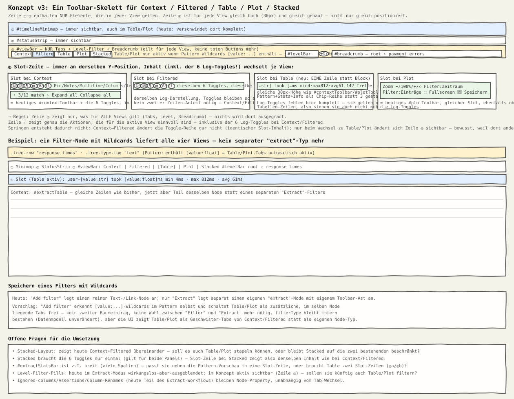

# Konzeptvorschlag: Table/Plot als Tabs statt separater Extract-View

Status: **Vorschlag, nicht umgesetzt.** Dient als Diskussionsgrundlage — kein
Code wurde geändert. **v3** — zweimal überarbeitet: v2 verschob die
Log-Toggles in die Slot-Zeile (siehe "Warum v1 nicht ausreichte"), v3
vereinheitlicht zusätzlich die *Optik* der Slot-Zeile selbst (siehe
"Design der Slot-Zeile" unten) — reine Positionsgleichheit reichte nicht,
wenn die Bauform (Höhe, Layout) je View trotzdem unterschiedlich bliebe.

## Problem

`renderMainView()` behandelt einen `filterType: "extract"`-Node heute
komplett anders als alle übrigen Nodes (`philogg.html:8874-8910`):

- `#viewBar` bleibt zwar sichtbar, aber `#fhTabs`, `#levelBar`,
  `#btnPinBookmarks`, `#btnNotes`, `#btnMultilineMsg`, `#btnColumns`,
  `#btnTextMatchHighlight` und `#btnHighlightMatchText` werden komplett
  ausgeblendet — nur `#breadcrumb` bleibt übrig.
- `#timelineMinimap` und `#statusStrip` verschwinden ganz.
- Statt `#fhSplit` erscheint `#extractWrap` mit einem eigenen,
  strukturell anderen Toolbar (`#extractToolbar`: Pattern-Vorschau,
  Stats-Bar, dann erst die Table/Plot-Tabs).

Wechselt man zwischen einem normalen Filter-Node und einem Extract-Node
(oder legt für denselben Datensatz einmal einen Filter- und einmal einen
Extract-Node an), springt damit fast die gesamte obere Hälfte des
Bildschirms um — Elemente verschwinden, tauchen an anderer Stelle wieder
auf, oder gar nicht mehr.

## Sketch

## Warum v1 nicht ausreichte

Die erste Fassung hielt `#viewBar` — inklusive der sechs Log-Toggles
(`Pin`, `Notes`, `Multiline`, `Columns`, `TextMatch`, `HighlightMatch`) —
für jede View unverändert sichtbar und schaltete sie in Table/Plot nur grau.
Das behebt zwar das *positionelle* Springen, erzeugt aber ein neues
Problem: In Table/Plot ergeben diese Buttons inhaltlich keinen Sinn
("Multi-line message display" für eine Tabelle mit Zahlenspalten?) — sechs
dauerhaft tote Buttons sind kein Fortschritt gegenüber springenden
Buttons, nur eine andere Art von Inkonsistenz. Konsequenter: Elemente, die
nur für bestimmte Views gelten, gehören konsequent in die view-spezifische
Slot-Zeile, nicht in die universelle Leiste — auch wenn das bedeutet, dass
sich beim Wechsel zu Table/Plot mehr in Zeile ④ ändert als bei v1.

## Kernidee

1. **Ein festes 4-Zeilen-Skelett für alle Views**, immer in derselben
   Reihenfolge und an derselben Position — aber Zeile ③ enthält jetzt
   *nur* Elemente, die wirklich für jede View gelten:
   1. `#timelineMinimap`
   2. `#statusStrip`
   3. `#viewBar` — reduziert auf Tabs + `#levelBar` + `#breadcrumb`.
      Nichts davon wird je ausgegraut, weil alles drei für jede View
      Sinn ergibt (auch eine Tabelle hat eine Zeitspanne, einen
      Level-Filter, eine Filterkette).
   4. Eine **Slot-Zeile**: immer an derselben Y-Position, ihr Inhalt ist
      view-spezifisch — und trägt jetzt auch die sechs Log-Toggles, wo sie
      hingehören:
      - **Context** und **Filtered**: die sechs Toggles (`Pin`, `Notes`,
        `Multiline`, `Columns`, `TextMatch`, `HighlightMatch`) plus, nur
        bei Context, `#contextToolbar` (Prev/Next-Match,
        Expand/Collapse). Da Context/Filtered benachbarte Tabs sind und
        beide dieselbe Log-Zeilendarstellung nutzen, bleibt der
        Toggle-Block beim Wechsel zwischen den beiden an exakt derselben
        Stelle — kein Springen zwischen den beiden häufigsten Views.
      - **Table**: Pattern-Vorschau + Stats-Chips (heutiges
        `#extractPatternView`/`#extractStatsBar`) — ohne die Log-Toggles,
        die hier nichts zu suchen haben.
      - **Plot**: das heutige `#plotToolbar` (Zoom, Zeitraum-/
        Entries-Filter, Fullscreen, Speichern) — ebenfalls ohne die
        Log-Toggles.
      - **Stacked**: derselbe Toggle-Block wie Context/Filtered (gilt für
        beide gestapelten Panels gemeinsam).

2. **`#fhTabs` wird um `Table` und `Plot` erweitert**: statt
   `Context | Filtered | Stacked` künftig
   `Context | Filtered | Table | Plot | Stacked`. Die beiden neuen Tabs
   sind nur aktivierbar, wenn das Pattern des aktiven Nodes
   `[value:...]`-Platzhalter enthält — sonst sichtbar, aber deaktiviert
   (das macht dem Nutzer transparent, *dass* die Funktion existiert, statt
   sie hinter einem separaten "Extract"-Button zu verstecken).

3. **Ein Node, kein zweiter Baumeintrag.** Heute erzeugt "Extract" im
   Filter-Popup einen eigenen Node mit `filterType: "extract"` — ein
   zweiter Eintrag im Baum für denselben Gedanken ("dieses Pattern will
   ich auch tabellarisch/geplottet sehen"). Im Vorschlag reicht ein
   normaler Filter-Node mit Wildcard-Pattern: Speichern legt weiterhin nur
   *einen* Node an; Table/Plot sind zusätzliche Ansichten desselben Nodes
   statt eines eigenen Node-Typs. `filterType`, `ignoredColumns`,
   `assertions`, `columnRenames`, `plotConfig` bleiben als Node-Properties
   bestehen (Datenmodell unverändert) — nur ihre UI-Sichtbarkeit ändert
   sich von "eigener Node" zu "Tab am bestehenden Node".

## Design der Slot-Zeile: nicht nur Position, auch Optik vereinheitlichen

Strukturell sitzen `#contextToolbar`, `#extractToolbar` und `#plotToolbar`
heute schon an vergleichbarer Stelle (oberste Zeile ihrer jeweiligen
Content-Spalte) und teilen sich `background:var(--bg-panel)` und
`border-bottom:1px solid var(--border)` — insofern ist die Optik nicht
komplett unterschiedlich. Der eigentliche Bruch: `#contextToolbar` und
`#plotToolbar` sind feste **30px-Zeilen** (`philogg.html:1442-1446`,
`:2297-2301`), `#extractToolbar` dagegen ein **mehrzeiliger Block**
(`padding:9px 16px; gap:8px`, `philogg.html:1708-1711` — Pattern-Vorschau
+ Stats-Bar + Info-Zeile übereinander). Dadurch wirkt der Table-Toolbar
heute wie ein Info-Panel, das zur Tabelle gehört, statt wie eine schmale
Werkzeugleiste, die zur `#viewBar`-Familie gehört — das ist Teil desselben
"Springens", nur optisch statt positionell.

**Vorschlag:** Die Slot-Zeile bekommt eine einheitliche, feste Höhe (analog
zu den heutigen 30px) für alle Views. Für Table heißt das konkret:

- Die Pattern-Vorschau wird zu einer einzeiligen, ggf. horizontal
  scrollbaren Chip-Leiste statt eines mehrzeiligen Blocks (ähnlich den
  `.column-chip`s im Filter-Popup).
- Die Stats-Chips (`min`/`max`/`avg`/`count`) rücken in dieselbe Zeile statt
  eine eigene Zeile zu belegen — bei vielen Spalten horizontal scrollbar,
  nicht umbrechend.
- `#extractInfo` (Treffer-Anzahl) wandert dorthin, wo bei Context/Plot
  vergleichbare Meta-Info sitzt (linksbündig in derselben Zeile), statt in
  einer eigenen `.extract-toolbar-row2`.

Damit ist nicht nur die Y-Position der Slot-Zeile für jede View identisch,
sondern auch ihre Bauform (eine feste Höhe, ein visuelles Gewicht) — die
Slot-Zeile liest sich dann konsequent als Teil der Werkzeugleisten-Familie,
nicht als Teil der Content-Fläche darunter.

## Was bewusst gleich bleibt

- Die sechs Toggle-Icons behalten Reihenfolge und Position **zwischen
  Context, Filtered und Stacked** — dort, wo sie tatsächlich gelten, wackeln
  sie nicht. Nur beim Wechsel zu Table/Plot verschwinden sie bewusst, weil
  sie dort keine Wirkung hätten.
- `#levelBar` bleibt in Zeile ③ für jede View sichtbar und aktiv; ob die
  Pillen Table/Plot tatsächlich filtern sollen, ist eine offene Frage
  (siehe unten), aber die *Position* wackelt nie.
- `#breadcrumb` bleibt ganz rechts in `#viewBar`, unabhängig von der
  aktiven View.
- Context-, Filtered- und Stacked-Verhalten selbst ändert sich nicht —
  nur wie Table/Plot daneben eingehängt werden.

## Offene Fragen für eine Umsetzung

- **Stacked mit Table/Plot?** Stacked kombiniert heute Context+Filtered.
  Soll es künftig auch Table oder Plot stapeln können, oder bleibt Stacked
  auf die zwei bisherigen View beschränkt?
- **Stats-Bar-Breite.** `#extractStatsBar` kann bei vielen Wertespalten
  breiter werden als eine Zeile verträgt — braucht Table ggf. zwei
  Slot-Zeilen (Pattern-Vorschau + Stats separat), oder wird die Stats-Bar
  gekürzt/scrollbar?
- **Level-Filter-Wirkung auf Table/Plot.** Aktuell wendet
  `renderExtractTable()` den zuletzt gesetzten Level-Filter intern an,
  ohne sichtbare Pillen. Im Konzept sind die Pillen sichtbar — sollen sie
  dann auch aktiv Table/Plot filtern, oder bleiben sie dort deaktiviert?
- **Migration bestehender Sessions/Exporte.** Vorhandene `extract`-Nodes
  in gespeicherten Sessions müssten weiterhin ladbar bleiben (kein
  Breaking Change im JSON-Format) — die Änderung wäre rein an der
  Render-Seite (`renderMainView()`/`#viewBar`/`#fhTabs`), nicht am
  Persistenzformat.

## Betroffene Stellen (für eine spätere Umsetzung)

- `renderMainView()` (`philogg.html:8835`) — die `isExtract`-Sonderbehandlung
  entfällt, `#viewBar`/`#fhTabs` bleiben für jeden Node-Typ aktiv.
- `#fhTabs`-Markup (`philogg.html:2914`) — zwei zusätzliche `.view-tab`
  Buttons (`data-fh-tab="table"`/`"plot"`).
- `#extractToolbar` (`philogg.html:3033`) — Inhalt wandert in die
  Slot-Zeile um, das umschließende `#extractWrap` bleibt als Content-Fläche
  bestehen (nur ohne eigenen Toolbar-Ast).
- `docs/ui-and-views.md` / `docs/extraction-and-plotting.md` — nach einer
  Umsetzung entsprechend aktualisieren.
