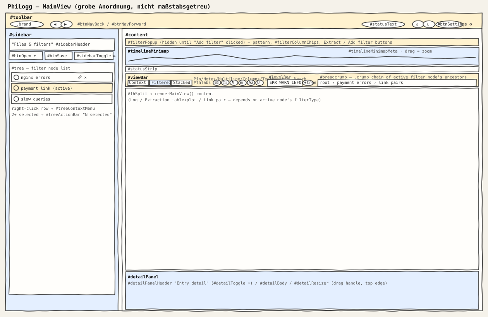
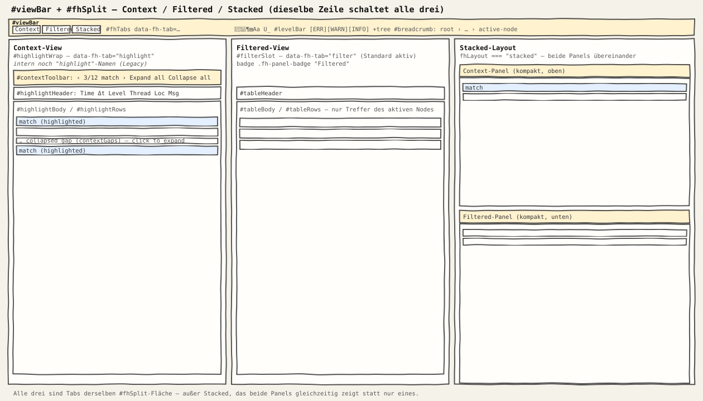
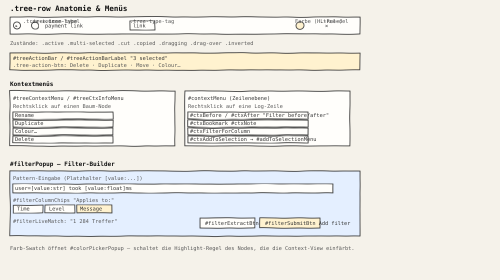
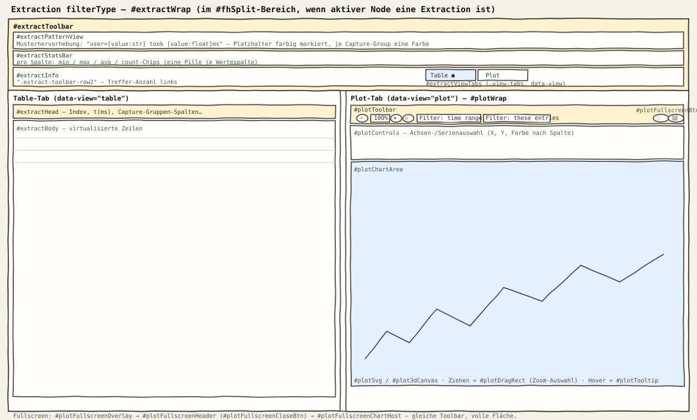

# UI Sketches — labeled element reference

Hand-sketch-style diagrams of PhiLogg's UI, laid out to match the actual
top-to-bottom / left-to-right element order in `philogg.html` (not to
scale, but positionally accurate), labeled with the terms already
established in code and `docs/ui-and-views.md` — a shared vocabulary for
conversation.

## MainView

Top to bottom in `#content`: the (usually hidden) `#filterPopup` filter
builder, `#timelineMinimap`, `#statusStrip`, then **`#viewBar`** — one row
(per `philogg.html`'s own comment, it merges what used to be three separate
rows) holding, left to right: `#fhTabs` (Context/Filtered/Stacked),
`#btnPinBookmarks`, `#btnNotes`, `#btnMultilineMsg`, `#btnColumns`,
`#btnTextMatchHighlight`, `#btnHighlightMatchText`, `#levelBar` (level
pills), `#btnApplyLevelToTree`, and `#breadcrumb` (the active filter
node's `.crumb` chain) filling the rest of the row. Below that,
`#fhSplit` (`renderMainView()`'s output — Log / Extraction / Link pair
view) and `#detailPanel` ("Entry detail").

- **`#toolbar`** — header: brand, back/forward nav, status text, undo/redo, settings.
- **`#sidebar`** — `#sidebarHeader` ("Files & filters": `#btnOpen`, `#btnSave`,
  `#sidebarToggle`) above `#tree`, the filter node tree; `#treeActionBar`
  appears on multi-select.

## Filter views: Context / Filtered / Stacked

Switched via **`#fhTabs`** (`.view-tabs`, `data-fh-tab`):

- **Context** (`data-fh-tab="highlight"`) — `#highlightWrap`. Internally
  still named "highlight" throughout the code (legacy naming, documented in
  `docs/ui-and-views.md`); Context-specific additions use a `context*`
  prefix (`buildContextView`, `contextGaps`, `contextStrips`, …). Toolbar:
  `#contextToolbar` (prev/next match, expand/collapse all).
- **Filtered** (`data-fh-tab="filter"`, default active) — `#filterSlot`,
  badge `.fh-panel-badge` "Filtered". Table: `#tableHeader`/`#tableBody`/`#tableRows`.
- **Stacked** (`data-fh-tab="stacked"`) — both panels shown at once,
  `fhLayout === "stacked"`, Context on top, Filtered below.

## Filter tree & context menus

- **`.tree-row`** anatomy: `.tree-icon`, `.tree-icon-type`, `.tree-label`,
  `.tree-type-tag`, colour swatch (opens `#colorPickerPopup`, toggles the
  node's highlight rule), `.tree-del`.
- Row states: `.active`, `.multi-selected`, `.cut`, `.copied`, `.dragging`,
  `.drag-over`, `.inverted`.
- Two distinct context menus: **`#treeContextMenu`**/`#treeCtxInfoMenu`
  (right-click a tree node) vs. **`#contextMenu`** (right-click a log row:
  `#ctxAfter`, `#ctxBefore`, `#ctxBookmark`, `#ctxNote`,
  `#ctxFilterForColumn`, `#ctxAddToSelection`).
- Filter builder popup: `#filterColumnChips` ("Search in"),
  `#filterLiveMatch`, `#filterExtractBtn` ("Extract"), `#filterSubmitBtn`
  ("Add filter").

## Extraction view: Table / Plot tabs

`#extractWrap` → **`#extractToolbar`**, top to bottom: `#extractPatternView`
(the pattern preview — placeholders colour-coded per capture group),
`#extractStatsBar` (min/max/avg/count chips per value column), then
`.extract-toolbar-row2` with `#extractInfo` (match count) on the left and
**`#extractViewTabs`** (`.view-tabs`, `data-view`) on the right:

- **Table** (`data-view="table"`, default) — `#extractHead`/`#extractBody`
  inside `#extractTable`/`#extractScroll`.
- **Plot** (`data-view="plot"`) — `#plotWrap` → `#plotToolbar`
  (`#plot2dToolsGroup` zoom controls, "Filter: time range", "Filter: these
  entries") plus `#plotFullscreenBtn`/`#plotSaveImageBtn` → `#plotBody`
  (`#plotControls`, `#plotChartArea` with `#plotSvg`/`#plot3dCanvas`,
  `#plotDragRect`, `#plotTooltip`). Fullscreen:
  `#plotFullscreenOverlay` → `#plotFullscreenHeader`
  (`#plotFullscreenCloseBtn`) → `#plotFullscreenChartHost`.

---

See `docs/ui-and-views.md` for the full prose description of how these
regions interact (`renderMainView()` selection logic, `fhLayout`, theming).
